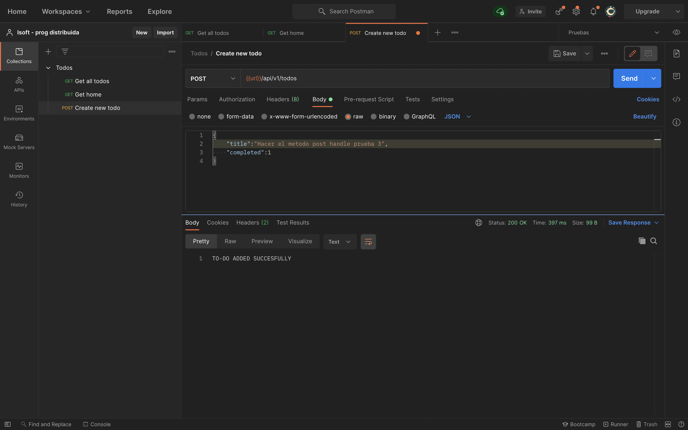
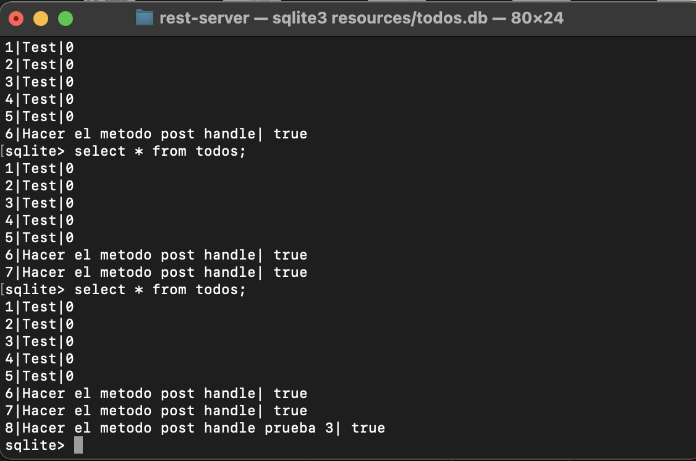
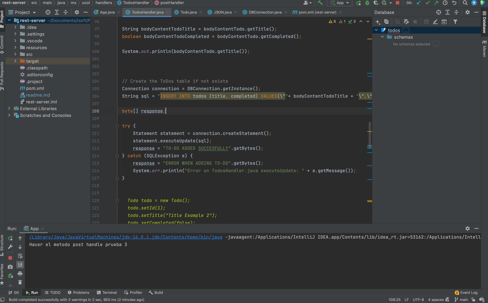

# Restful Server of To-do List

This is an resful api made with maven, JAVA and using sqlite as a DB, was made by [Jonathan solis].
What i have done is to make the postHandler method of the api in order to create new task into the DB,

## Installation
For instalation you need to have maeven and JDK installed, to do so i used homebrew for maeven running the following command:

```brew install maven```

and for JDK I donwload it in the following url: https://docs.oracle.com/en/java/javase/15/install/installation-jdk-macos.html#GUID-F575EB4A-70D3-4AB4-A20E-DBE95171AB5F

Then i used intelij to open the proyect and you just have to run the main class.


## Usage
The API can respond to the following endpoints:

```curl -d '{"title":"example title", "completed":"0"}' -H "Content-Type: application/json" -X POST http://localhost:800/api/v1/todos```

Responds with the following:

```
TO-DO ADDED SUCCESFULLY
```
OR
```
ERROR WHEN ADDING TO-DO
```

In order to see the DB I used sqlite3 in terminal, with the folliwing command
```sqlite resources/todo.db```




